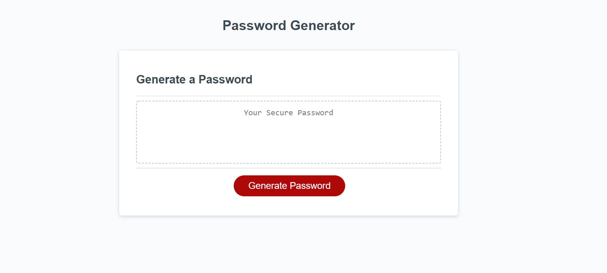
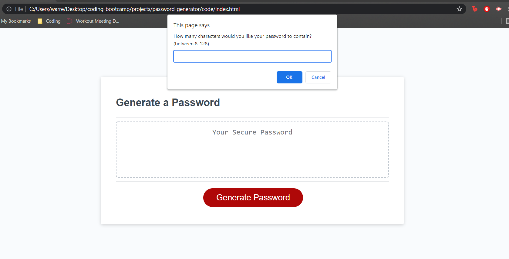
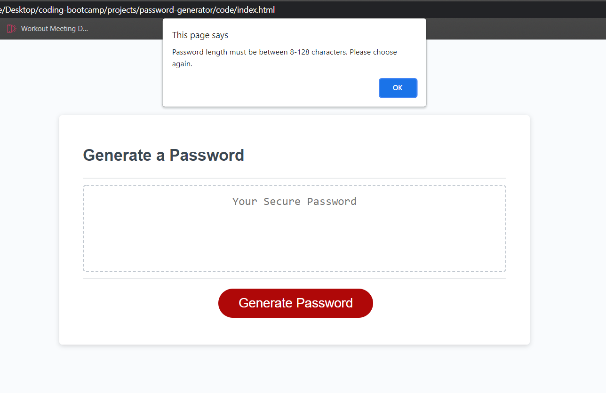
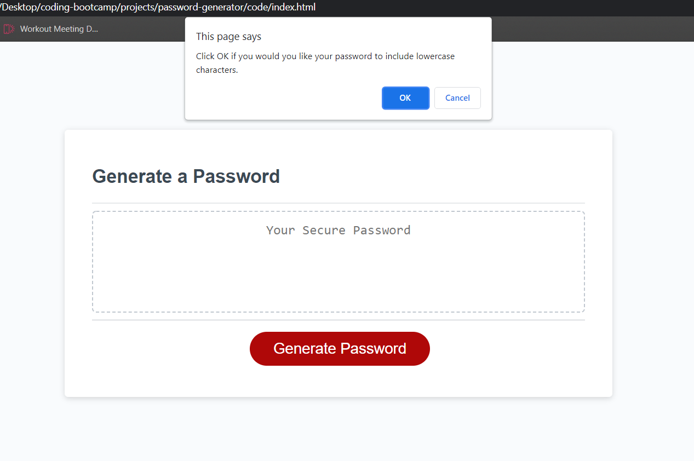
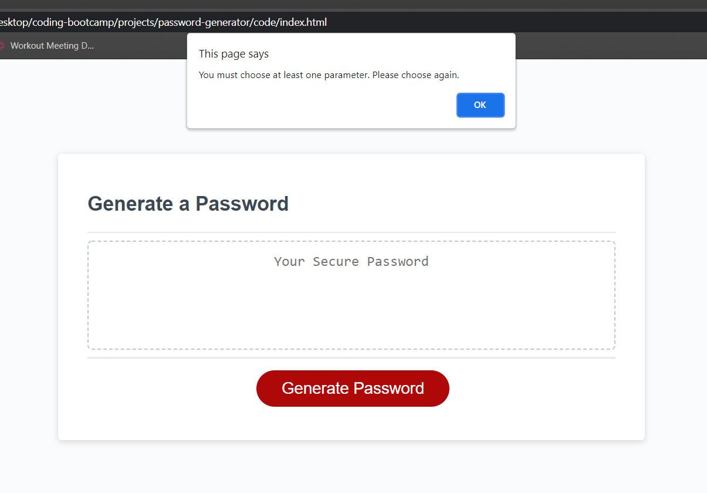
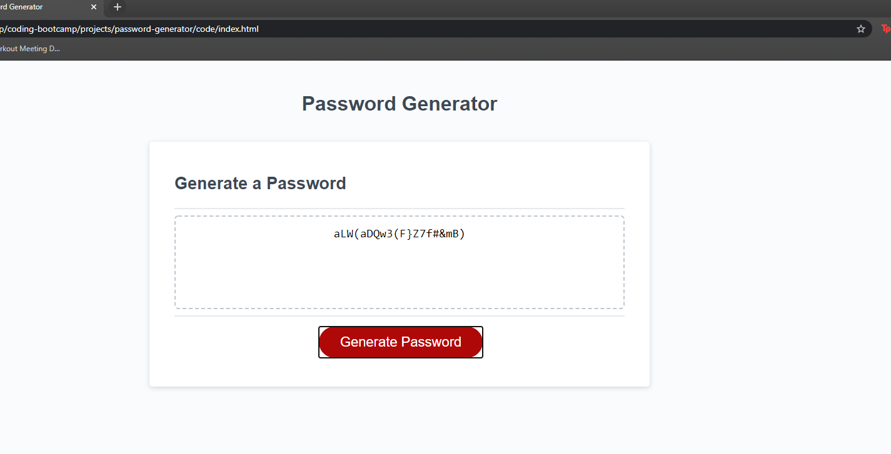

# Password Generator

## Description
This project was designed as a homework assignment for Rutgers coding bootcamp and introduces the use of JavaScript in the course. 

I was required to code a random password generator that met all of the acceptance criteria (listed below).

The project has:
* A generate button that will start a series of prompts in the browser window for the user
* A series of prompts that asks the user what criteria they'd like to have for their password (password length and characters to use)
* After the user has selected which criteria to use in their password, a random password is generated and displayed in the text area of the password generator

## Acceptance Criteria
* GIVEN I need a new, secure password
* WHEN I click the button to generate a password
* THEN I am presented with a series of prompts for password criteria
* WHEN prompted for password criteria
* THEN I select which criteria to include in the password
* WHEN prompted for the length of the password
* THEN I choose a length of at least 8 characters and no more than 128 characters
* WHEN asked for character types to include in the password
* THEN I confirm whether or not to include lowercase, uppercase, numeric, and/or special characters
* WHEN I answer each prompt
* THEN my input should be validated and at least one character type should be selected
* WHEN all prompts are answered
* THEN a password is generated that matches the selected criteria
* WHEN the password is generated
* THEN the password is either displayed in an alert or written to the page

## Screenshot
<<<<<<< HEAD
The loading page for the password generator, before clicking "Generate Password" button

Prompt asking user for desired password length

Alert user that password must be between 8-128 characters

Prompt asking user which characters to use

Alert user that password must choose at least 1 set of characters

=======
The home page for the password generator, before clicking "Generate Password" button

Prompting user to select desired password length

Alerting user that they must choose a password with an acceptable length

Prompting user to select which characters they'd like to use in their password

Alerting user  that they must select at least one set of characters before continuing

The final result, a randomly generated password with the user's specified length and character sets

## Project Insight
It helped to pseudocode my way through the project. I found that when I did use pseudocoding it was easier to keep track of my thoughts and where my coding was leading to. That being said, the actual coding presented several problems for me.
>>>>>>> develop

Where I had the most trouble was figuring out how to add all the user's selected characters and then randomly output a selection of those characters for the password. Eventually (after much trial and error, and lots of researching online) I was able to use the concat.() method to concatenate a random string of characters to use. It also took me time to debug my FOR loop. I was repeatedly getting on error message stating "passwordCharacters is not a function" and I couldn't generate a random password to the browser. It took some time but I was able to figure out that in order for my code to work I needed to change line77 from "passwordCharacters(Math.floor(Math.random() * passwordCharacters.length))" to what it is now -- "passwordCharacters[Math.floor(Math.random() * passwordCharacters.length)]" -- an array not a function. 

## Installation
No installation required. To execute this file, open in a browser

## Features
* HTML (index.html)
    * Contains basic user input items and button with divs and ids
* CSS (style.css)
    * Contains centering and styling for html user input features
    * Contains media queries
* JavaScript (script.js)
    * Contains variables and functions to execute the random password generation

## Links To Live Project
<<<<<<< HEAD
* GitHub Repository: https://github.com/warrenp11/password-generator
* GitHub IO: https://warrenp11.github.io/password-generator/
=======
* GitHub Repository: 
* GitHub IO: 
>>>>>>> develop

## Author
Peter Warren